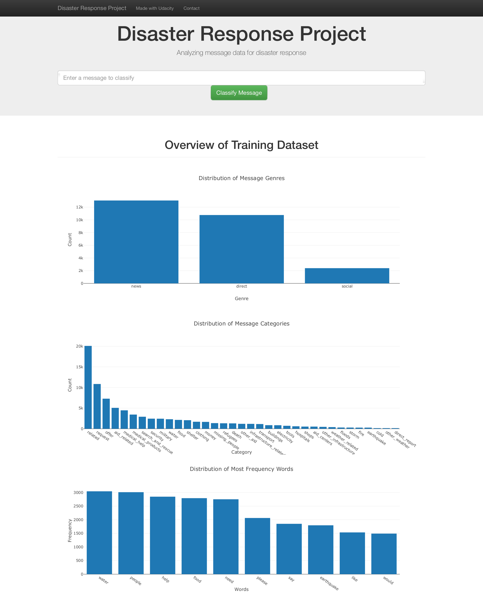
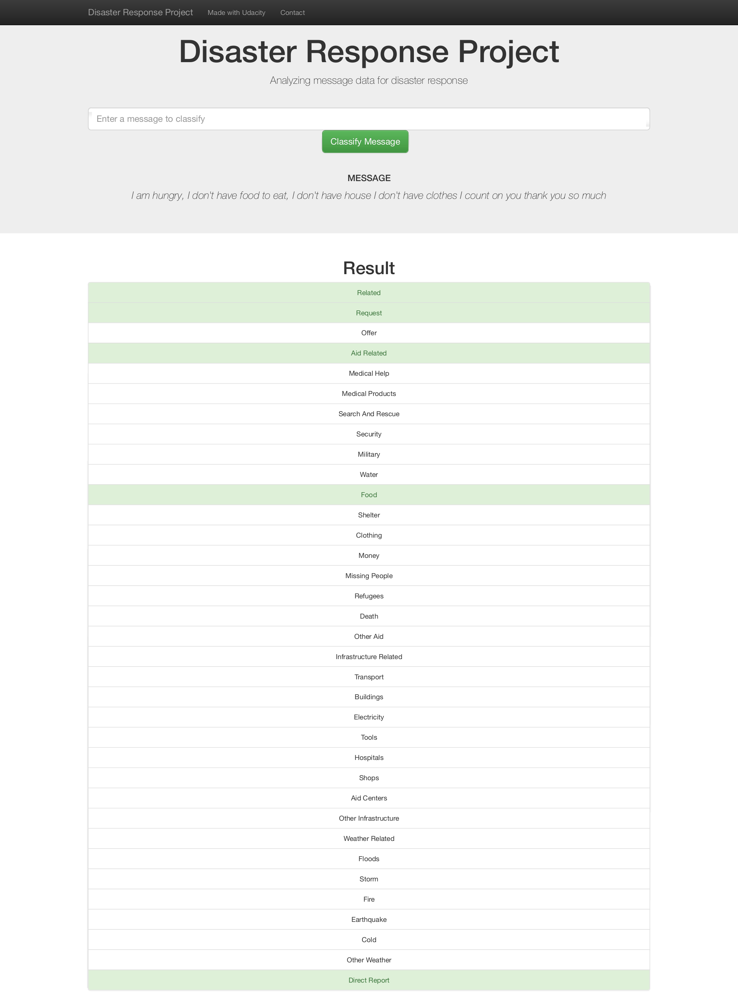
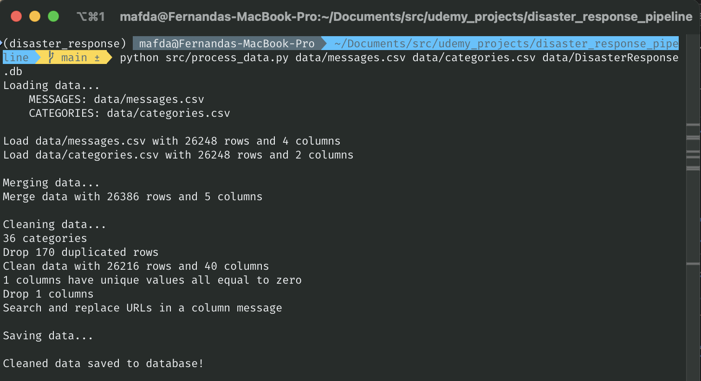
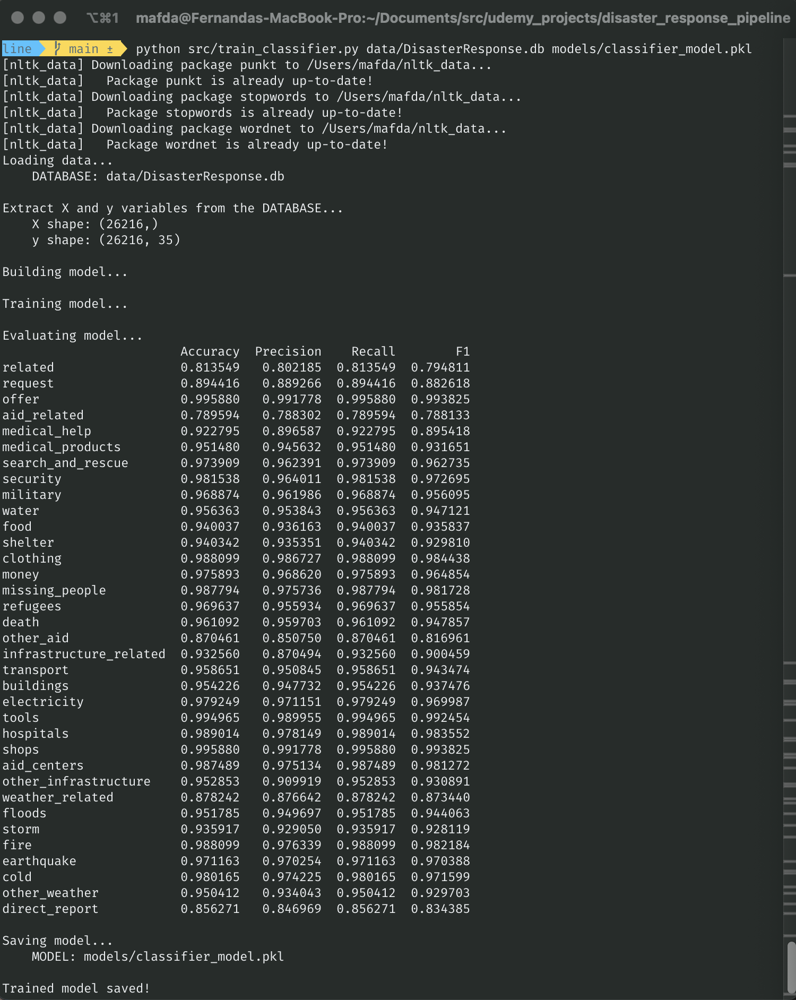
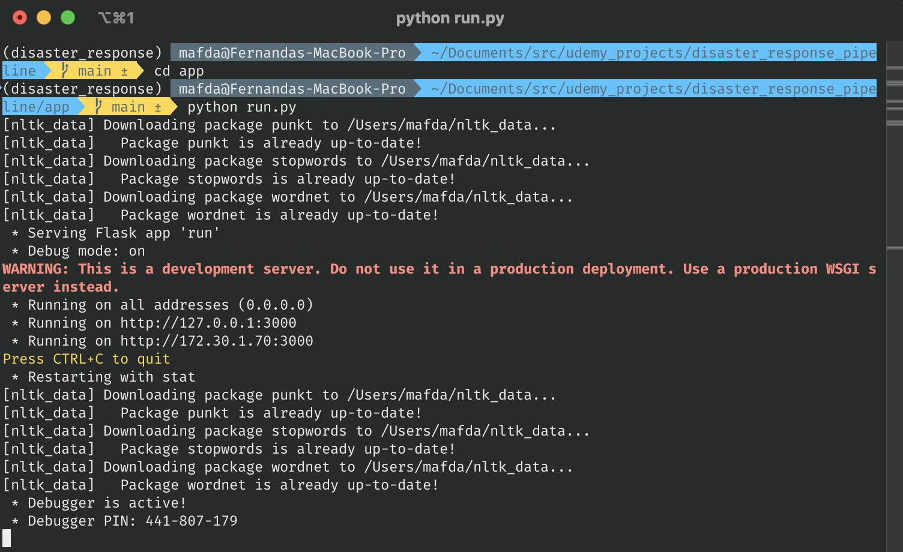

# Disaster Response Project

This project involves developing an ETL pipeline integrated with supervised learning and grid search to classify text messages sent during disaster events. 

It includes an ML pipeline and a web app designed to categorize disaster response messages in real time using Natural Language Processing (NLP) techniques.

 In this project, I'll apply data engineering skills to analyze disaster data from [Appen](https://www.figure-eight.com/) to build a model for an API that classifies disaster messages.

## Web App


| home page                          | results page                            |
| ---------------------------------- | --------------------------------------- |
|  |  |

## Project Setup

### Clone this repository

```shell
(base)$: git clone git@github.com:mafda/disaster_response_project.git
(base)$: cd disaster_response_project
```

### Configure environment

- Create the conda environment

    ```shell
    (base)$: conda env create -f environment.yml
    ```

- Activate the environment

    ```shell
    (base)$: conda activate disaster_response
    ```

- Download the dataset and model from [this
  link](https://drive.google.com/drive/folders/1uNqCHmE__m9tEV-pgvkBcu4iJFfkaSbN?usp=share_link),
  create `data` folder and copy the `categories.csv` and `messages.csv` datasets
  here.

    ```shell
    (disaster_response)$: mkdir data
    ```

## Project Structure

```shell
.
├── README.md
├── app
│   ├── run.py
│   └── templates
│       ├── go.html
│       └── master.html
├── data
│   ├── DisasterResponse.db
│   ├── categories.csv
│   └── messages.csv
├── environment.yml
├── models
│   └── classifier_model.pkl
├── notebooks
│   ├── ETL_Pipeline_Preparation.ipynb
│   └── ML_Pipeline_Preparation.ipynb
└── src
    ├── process_data.py
    └── train_classifier.py
```

## Project Components

**1. ETL Pipeline**

The first part of the data pipeline is the Extract, Transform, and Load process. I will read the dataset, clean the data, and then store it in a SQLite database.

File `src/process_data.py`, contains a data cleaning pipeline that:
* Loads the `messages.csv` and `categoriescsv` datasets
* Merges the two datasets
* Cleans the data
* Stores it in a SQLite database

**2. ML Pipeline**

The second part, I will create a machine learning pipeline that uses NLTK, as well as scikit-learn's Pipeline and GridSearchCV to output a final model that uses the `message` column to predict classifications for 36 categories (multi-output classification). Finally, I will export your model to a pickle file. 

File `src/train_classifier.py`, contains a machine learning pipeline that:
* Loads data from the SQLite database
* Splits the dataset into training and test sets
* Builds a text processing and machine learning pipeline
* Trains and tunes a model using GridSearchCV
* Outputs results on the test set
* Exports the final model as a pickle file

**3. Flask Web App**

In the last step, I'll display your results in a Flask web app.

File `app/run.py` will start the web app where users can enter their query and the machine learning model will categorize this event.
* Show data visualizations using Plotly in the web app.

## Executing Program

There are 3 steps to follow, from cleaning the data, through training the model, and ending with the web app.

### 1. Cleaning data

In the project directory, run:

```shell
(disaster_response)$: python src/process_data.py data/messages.csv data/categories.csv data/DisasterResponse.db
```



### 2. Training model

After the data cleaning process, in the project directory, run:

```shell
(disaster_response)$: python src/train_classifier.py data/DisasterResponse.db models/classifier_model.pkl
```



### 3. Web App

Go the `app` directory and run:

```shell
(disaster_response)$: cd app
(disaster_response) app $: python run.py
```


And go to http://localhost:3000

## Model Results

* **Model 0: Basic Pipeline**: This model sets up a basic text classification
  pipeline using Random Forest for multi-output classification.
* **Model 1: Grid Search with Hyperparameter Tuning**: This model aims to
  improve performance by tuning hyperparameters through cross-validation.
* **Model 2: Feature Union Pipeline**: Purpose: This model allows for more
  complex feature engineering by using FeatureUnion to potentially combine text
  features with other types of features in the future.

In summary, **Model 0** is a straightforward pipeline for text classification.
**Model 1** enhances this by performing hyperparameter tuning to optimize the
model. **Model 2** introduces a more flexible architecture, paving the way for
incorporating additional feature sets beyond text.

Based on the provided results, here's a detailed analysis to determine which
model has the best performance:

| Model                                           | F1 Score Mean | Standard Deviation |
| ----------------------------------------------- | ------------- | ------------------ |
| Model 0: Basic Pipeline                         | 0.935306      | 0.056039           |
| Model 1: Grid Search with Hyperparameter Tuning | 0.931143      | 0.061321           |
| Model 2: Feature Union Pipeline                 | 0.935085      | 0.056090           |
  
### Analysis

F1 Score Mean:

* Model 0 has the highest mean F1 score (0.935306), closely followed by Model 2
  (0.935085).
* Model 1 has the lowest mean F1 score (0.931143).

Standard Deviation:

* Model 0 has a standard deviation of 0.056039.
* Model 2 has a slightly higher standard deviation of 0.056090.
* Model 1 has the highest standard deviation (0.061321), indicating more
  variability in performance.

* **Best Performance:** Model 0 has the best performance with the highest mean
  F1 score (0.935306) and a relatively low standard deviation (0.056039),
  indicating both strong and consistent performance.
* **Second Best:** Model 2 is very close in performance to Model 0, with a
  nearly identical mean F1 score (0.935085) and a slightly higher standard
  deviation (0.056090).
* **Least Preferred:** Model 1 has the lowest mean F1 score (0.931143) and the
  highest standard deviation (0.061321), making it the least preferred model in
  terms of both average performance and consistency.

## Conclusion

I have chosen **Model 2** as the best model for the following reasons:

* Flexible Architecture: Model 2 introduces a more flexible architecture by
  incorporating a FeatureUnion, which allows for the integration of multiple
  feature extraction pipelines. This flexibility enables the potential for
  incorporating additional feature sets beyond text, making it more adaptable
  for future enhancements and improvements.

* Comparable Performance: Although Model 1 has a slightly higher mean F1 score
  (0.935306) compared to Model 2 (0.935085), the difference is marginal. Model
  2’s mean F1 score is nearly identical to Model 1, and its standard deviation
  (0.056090) is also very close to that of Model 1 (0.056039). This demonstrates
  that Model 2 achieves almost the same level of performance as Model 1 in terms
  of accuracy and consistency.

Given these factors, Model 2 not only offers competitive performance but also
provides greater flexibility for incorporating additional features in the
future, making it the most suitable choice for this project.

## References

- [Data Scientist Nanodegree
  Program](https://www.udacity.com/course/data-scientist-nanodegree--nd025)

---

made with 💙 by [mafda](https://mafda.github.io/)
